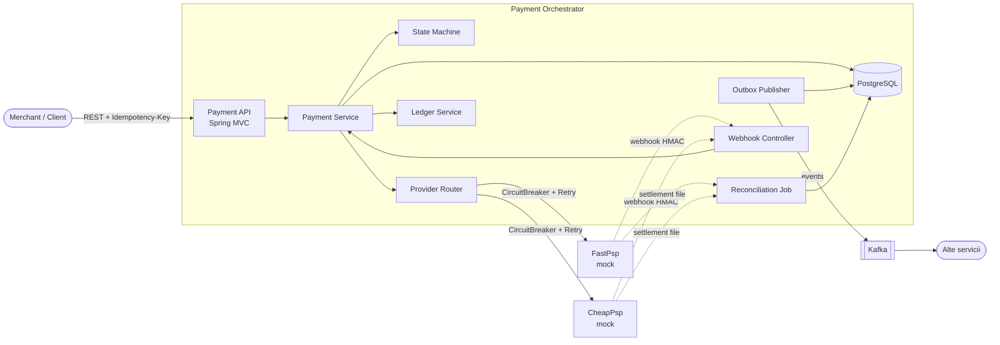
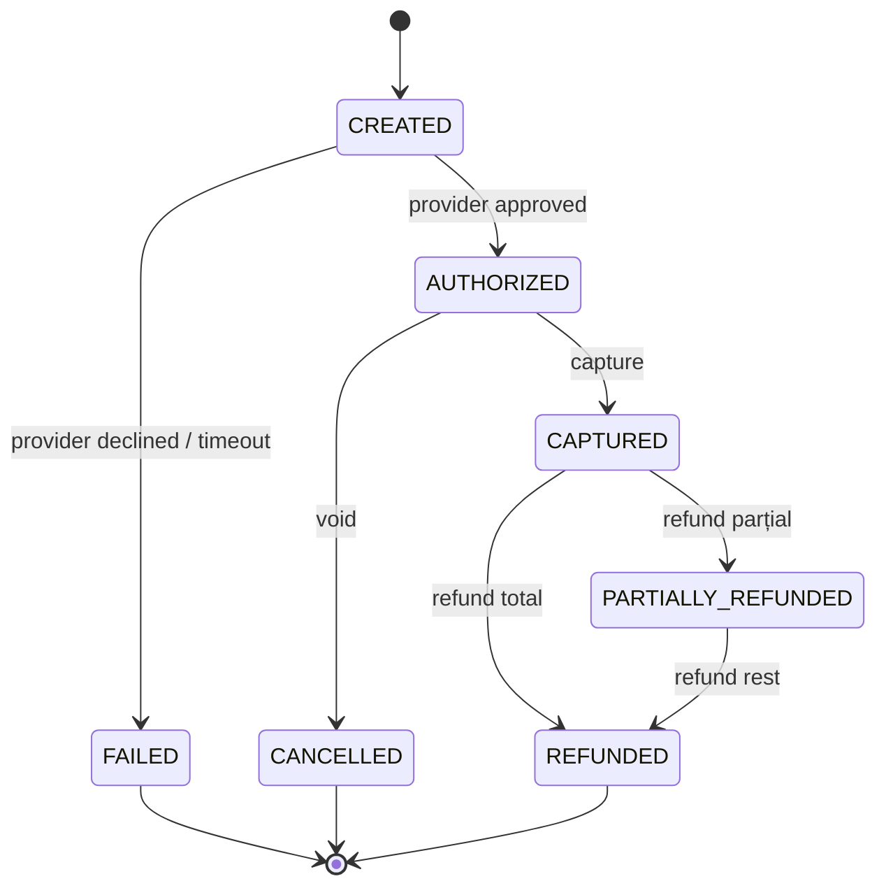
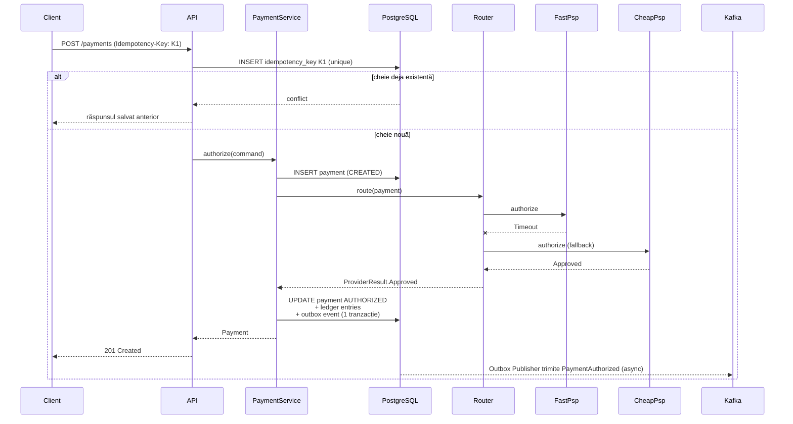

# Payment Orchestrator

Un mini-PSP (Payment Service Provider) construit cu **Spring Boot 3** și **Java 21**. Primește plăți, le rutează către mai mulți provideri (simulați), gestionează ciclul de viață complet (authorize → capture → refund) și garantează consistența prin idempotență, outbox pattern și un ledger double-entry.

Proiectul este gândit ca demonstrație de design pentru sisteme de plăți: probleme reale (duplicate, timeouts, race conditions, reconciliere), nu doar CRUD.

---

## 1. Ce face

| Funcționalitate | Descriere |
|---|---|
| **API REST** | `POST /payments`, `POST /payments/{id}/capture`, `POST /payments/{id}/refunds`, `GET /payments/{id}` |
| **Idempotență** | Header `Idempotency-Key`; același request trimis de două ori (chiar în paralel) produce o singură plată. Garantat prin unique constraint în DB |
| **State machine** | `CREATED → AUTHORIZED → CAPTURED → REFUNDED`, plus `FAILED`/`CANCELLED`. Tranzițiile invalide sunt respinse |
| **Routing provideri** | Alege providerul (`FastPsp`, `CheapPsp`) după reguli (monedă, sumă, cost); fallback automat dacă unul pică |
| **Resilience** | Circuit breaker, retry cu backoff și timeout per provider (Resilience4j) |
| **Outbox + evenimente** | Evenimentele (`PaymentAuthorized`, `PaymentCaptured`...) sunt scrise în aceeași tranzacție cu plata și publicate asincron în Kafka |
| **Webhooks** | Primește notificări de la provideri, validează semnătura HMAC, le procesează idempotent |
| **Ledger double-entry** | Fiecare mișcare de bani generează intrări debit/credit care trebuie să se echilibreze |
| **Reconciliere** | Job batch care compară ledger-ul intern cu fișierul de settlement al providerului și raportează diferențele |
| **Observabilitate** | Metrici Micrometer/Prometheus, dashboard Grafana, `correlationId` în toate log-urile |

---

## 2. Arhitectură

### 2.1 Vedere de ansamblu



### 2.2 State machine-ul unei plăți



### 2.3 Flux: authorize cu idempotență și fallback



### 2.4 Structura modulelor

```
payment-orchestrator/
├── api/            # controllere, DTO-uri (records), exception handlers
├── domain/         # Payment, Money, PaymentState, evenimente (sealed)
├── application/    # servicii, comenzi, state machine, routing
├── provider/       # interfața PaymentProvider + FastPsp, CheapPsp (mock)
├── ledger/         # intrări double-entry
├── outbox/         # tabel outbox + publisher către Kafka
├── reconciliation/ # job batch + parsare fișiere settlement
├── infra/          # config Spring, Resilience4j, Kafka, observabilitate
└── docs/adr/       # Architecture Decision Records
```

---

## 3. Noțiuni Java 21 folosite

### 3.1 Virtual Threads (JEP 444)

**Ce sunt:** thread-uri ușoare gestionate de JVM, nu de OS. Poți avea sute de mii simultan; un thread virtual blocat pe I/O nu ține ocupat un thread de platformă.

**Unde:** apelurile către provideri și DB sunt blocante. În loc de WebFlux/reactive, păstrăm cod imperativ simplu:

```yaml
spring:
  threads:
    virtual:
      enabled: true
```

**Bonus pentru repo:** un benchmark (k6) comparând throughput și latența cu thread pool clasic vs. virtual threads, cu rezultatele în `docs/benchmarks/`.

### 3.2 Records (JEP 395)

**Ce sunt:** clase imutabile, concise, cu `equals/hashCode/toString` generate.

**Unde:** DTO-uri, comenzi, evenimente, value objects.

```java
public record Money(BigDecimal amount, Currency currency) {
    public Money {
        Objects.requireNonNull(amount);
        Objects.requireNonNull(currency);
        if (amount.signum() < 0) throw new IllegalArgumentException("amount < 0");
    }
    public Money add(Money other) { /* verifică moneda */ }
}

public record AuthorizeCommand(String idempotencyKey, Money amount, String merchantId) {}
```

### 3.3 Sealed Interfaces/Classes (JEP 409)

**Ce sunt:** restricționează explicit ce tipuri pot implementa o interfață, deci compilatorul cunoaște toate variantele.

**Unde:** rezultatul unui provider și evenimentele de domeniu sunt modelate ca *algebraic data types*.

```java
public sealed interface ProviderResult {
    record Approved(String providerRef, Instant at) implements ProviderResult {}
    record Declined(String reason, String code)     implements ProviderResult {}
    record Timeout(Duration after)                  implements ProviderResult {}
}

public sealed interface PaymentEvent {
    record Authorized(PaymentId id, Money amount) implements PaymentEvent {}
    record Captured(PaymentId id, Money amount)   implements PaymentEvent {}
    record Refunded(PaymentId id, Money amount)   implements PaymentEvent {}
}
```

### 3.4 Pattern Matching for switch + Record Patterns (JEP 441, JEP 440)

**Ce sunt:** `switch` care face match pe tip și destructurează recordurile direct. Pe tipuri sealed, compilatorul verifică **exhaustivitatea**: dacă adaugi un tip nou și uiți un caz, nu compilează.

**Unde:** procesarea rezultatelor providerilor și aplicarea evenimentelor pe state machine.

```java
Payment apply(Payment p, ProviderResult result) {
    return switch (result) {
        case Approved(var ref, var at)   -> p.authorized(ref, at);
        case Declined(var reason, var c) -> p.failed(reason);
        case Timeout t                   -> p.failed("timeout after " + t.after());
        // fără default: compilatorul garantează exhaustivitatea
    };
}
```

Avantaj față de Java 11: dispar lanțurile `instanceof` + cast, iar bug-urile de tip „am uitat un caz" devin erori de compilare.

### 3.5 Sequenced Collections (JEP 431)

**Ce sunt:** interfețe noi (`SequencedCollection`, `SequencedMap`) cu ordine definită și metode `getFirst()`, `getLast()`, `reversed()`, `addFirst()`.

**Unde:** istoricul tranzițiilor unei plăți.

```java
SequencedCollection<StateTransition> history = payment.history();
StateTransition last = history.getLast();            // înainte: list.get(list.size() - 1)
history.reversed().forEach(audit::log);              // de la cea mai recentă
```

### 3.6 Structured Concurrency (JEP 453, *preview*)

**Ce este:** tratează un grup de task-uri concurente ca o singură unitate de lucru: dacă una eșuează sau câștigă, restul sunt anulate automat, fără thread-uri „orfane".

**Unde:** `ProviderRouter` cere în paralel cotația de comision de la toți providerii care suportă moneda, apoi îi încearcă pe rând, de la cel mai ieftin. Authorize în sine **nu** se rulează în paralel: are efecte la provider, iar un race între doi provideri ar putea autoriza aceeași plată de două ori.

```java
try (var scope = new StructuredTaskScope<Optional<Quote>>()) {
    var tasks = candidates.stream().map(p -> scope.fork(() -> quote(p, request))).toList();
    scope.joinUntil(Instant.now().plus(QUOTE_TIMEOUT));   // taskurile rămase sunt anulate la close()
    // se citesc doar subtask-urile cu state() == SUCCESS
}
```

> Preview în Java 21: se rulează cu `--enable-preview`. Se documentează în README și în ADR.

### 3.7 Scoped Values (JEP 446, *preview*)

**Ce sunt:** alternativă imutabilă și sigură la `ThreadLocal`, gândită pentru virtual threads (cost mic, fără scurgeri de memorie).

**Unde:** propagarea `correlationId` și `merchantId` prin tot flow-ul, inclusiv în task-urile fork-uite de structured concurrency.

```java
static final ScopedValue<String> CORRELATION_ID = ScopedValue.newInstance();

ScopedValue.where(CORRELATION_ID, requestId)
           .run(() -> paymentService.authorize(cmd));
```

### 3.8 Text Blocks (JEP 378, din Java 15, folosite intens)

**Unde:** SQL și payload-uri JSON în teste, fără escape-uri.

```java
String payload = """
    {
      "paymentId": "%s",
      "status": "CAPTURED"
    }
    """.formatted(id);
```

### 3.9 Rezumat

| Feature | JEP | Status în 21 | Rol în proiect |
|---|---|---|---|
| Virtual Threads | 444 | final | I/O blocant scalabil (provideri, DB) |
| Records | 395 | final | DTO, comenzi, value objects |
| Sealed types | 409 | final | `ProviderResult`, `PaymentEvent` |
| Pattern matching switch | 441 | final | Procesare rezultate, state machine |
| Record patterns | 440 | final | Destructurare în `switch` |
| Sequenced collections | 431 | final | Istoric tranziții |
| Structured concurrency | 453 | preview | Apeluri paralele către provideri |
| Scoped values | 446 | preview | `correlationId` / context |
| Text blocks | 378 | final | SQL și JSON în teste |

---

## 4. Stack tehnologic

- **Limbaj/Framework:** Java 21, Spring Boot 3.3+, Spring Web, Spring Data JPA (sau jOOQ)
- **Bază de date:** PostgreSQL + Flyway
- **Mesagerie:** Kafka (outbox pattern)
- **Resilience:** Resilience4j
- **Observabilitate:** Micrometer, Prometheus, Grafana
- **Teste:** JUnit 5, Testcontainers, ArchUnit, k6 (benchmark)
- **Infra/CI:** Docker Compose, GitLab CI (`build → test → sonar → docker image`)

---

## 5. Rulare

Necesită JDK 21 și Maven (`mvn wrapper:wrapper` generează `mvnw`).

```bash
docker compose up -d                 # PostgreSQL
mvn spring-boot:run                  # pornește aplicația (cu --enable-preview)
mvn test                             # teste unitare
mvn verify                           # + teste de integrare (Testcontainers, necesită Docker)
```

Exemplu:

```bash
curl -s -X POST localhost:8080/payments \
  -H 'Content-Type: application/json' -H 'Idempotency-Key: demo-1' \
  -d '{"amount": 100.00, "currency": "RON", "merchantId": "m1"}'
```

Comportamente deterministice ale providerilor mock, utile pentru demo:

| Sumă | Rezultat |
|---|---|
| orice sumă normală în RON/EUR | `CheapPsp` (comision 1%) aprobă |
| `USD` | doar `FastPsp` suportă moneda |
| se termină în `.13` (ex. `100.13`) la `FastPsp` | Timeout → fallback pe celălalt provider |
| `>= 5000` la `CheapPsp`, `>= 10000` la `FastPsp` | Declined (final, fără fallback) |

---

## 6. Plan de implementare

1. **MVP:** create/authorize/capture + idempotență + Postgres + Flyway
2. **Provideri + resilience:** routing, fallback, circuit breaker, structured concurrency
3. **Evenimente:** outbox + Kafka + webhooks cu HMAC
4. **Ledger + reconciliere:** double-entry, job batch, raport diferențe
5. **Observabilitate + benchmark:** metrici, dashboard, comparație virtual threads vs. pool clasic
6. **Finisaje:** ADR-uri, README final, pipeline GitLab complet

---

## 7. Decizii de design (ADR-uri planificate)

- **ADR-001:** Idempotență prin unique constraint în DB, nu cache in-memory
- **ADR-002:** Outbox pattern în loc de dual-write DB + Kafka
- **ADR-003:** Virtual threads în loc de WebFlux
- **ADR-004:** Ledger double-entry ca sursă de adevăr pentru reconciliere
- **ADR-005:** Folosirea feature-urilor preview (structured concurrency, scoped values) și riscurile lor
